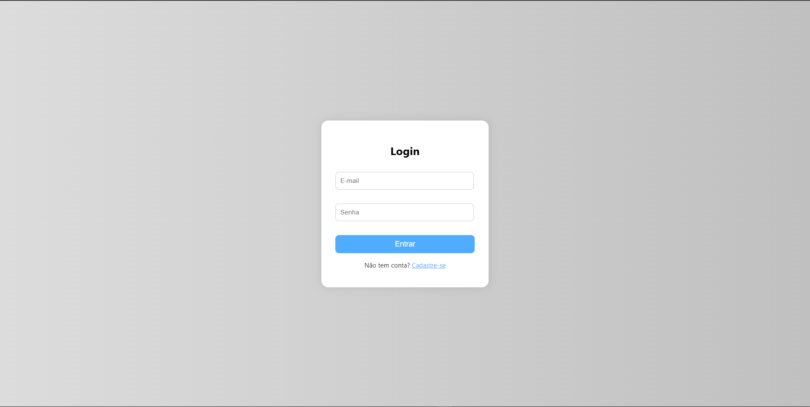
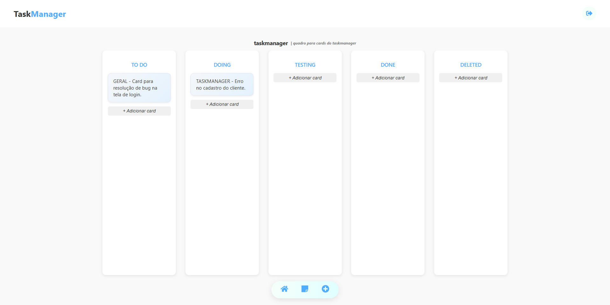

# 🗂️ TaskManager - Frontend

**TaskManager** é uma aplicação web fullstack para gerenciamento de tarefas, permitindo a criação, visualização, atualização e exclusão de atividades de forma prática e organizada.

## 🔍 Visão Geral

O projeto está dividido em duas partes:

- **Backend [taskmanager-frontend](https://github.com/CaueManoel/taskmanager-frontend)**: Desenvolvido com **Java + Spring Boot** 
- **Frontend  – *Este repositório***: Desenvolvido com **React**

## 🚀 Funcionalidades

- Criar e listar tarefas
- Atualizar status das tarefas apenas "arrastando" os cards (ex: "To do", "Doing", "Testing", "Done", "Deleted")
- Excluir tarefas
- Visualização organizada das tarefas por status (estilo Kanban)
- Interface moderna e responsiva

- ### 🖼️ Tela de Login

### 🖼️ Tela Inicial

## 🛠️ Tecnologias Utilizadas

### Frontend
- React
- Axios
- React Router
- Tailwind CSS

Desenvolvido por Caue Manoel
